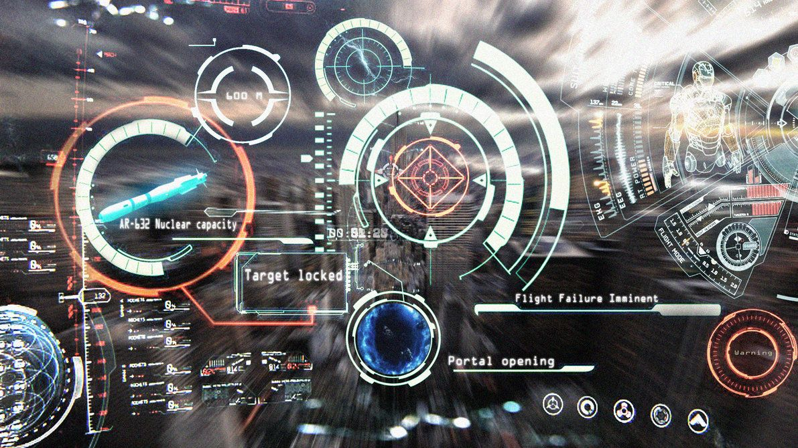
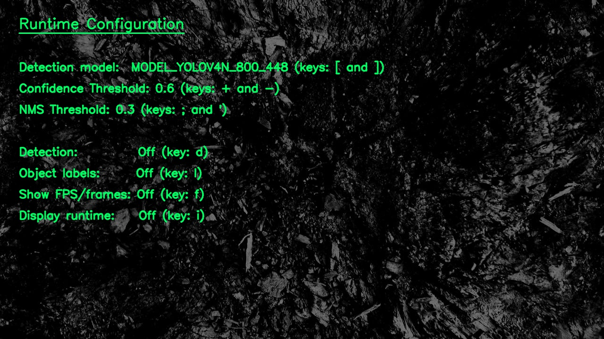
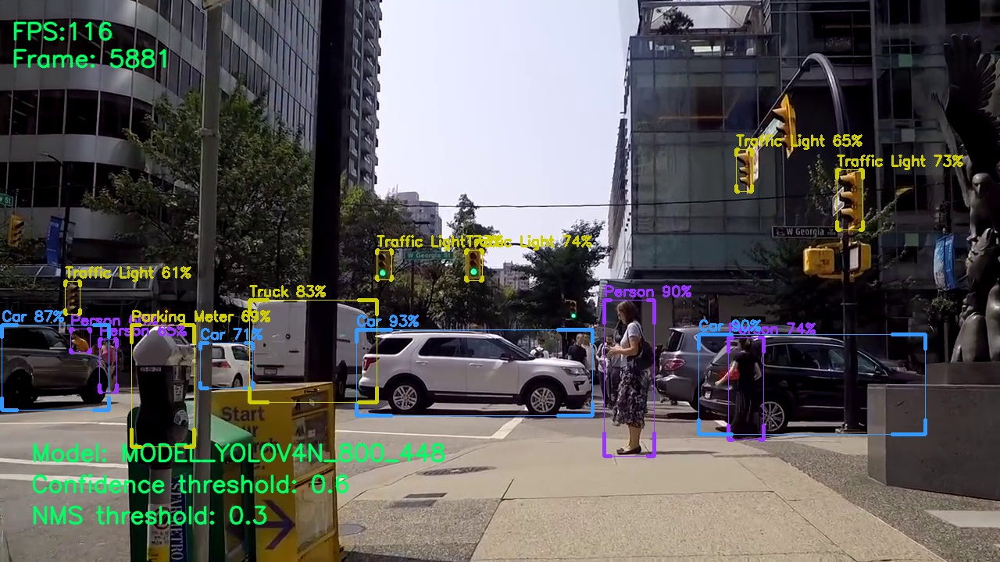

<!-- PROJECT SHIELDS -->
<!--
*** I'm using markdown "reference style" links for readability.
*** Reference links are enclosed in brackets [ ] instead of parentheses ( ).
*** See the bottom of this document for the declaration of the reference variables
*** for contributors-url, forks-url, etc. This is an optional, concise syntax you may use.
*** https://www.markdownguide.org/basic-syntax/#reference-style-links
-->
[![Contributors][contributors-shield]][contributors-url]
[![Forks][forks-shield]][forks-url]
[![Stargazers][stars-shield]][stars-url]
[![Issues][issues-shield]][issues-url]
[![GPL License][license-shield]][license-url]

<!-- PROJECT LOGO -->

  
    

    <h2 align="center">ML Image/Video Processing</h2>
    

  

<!-- ABOUT THE PROJECT -->
## About The Project

This project is to setup and explore the functionality of OpenCV. Design goals are to explore functionality to create a visual interface as an assistive interface for those with ASD.  The initial goals are to target eye-hand coordination and gross motor skills. 

Utilizing mediapipe and OpenCV the system will use onscreen buttons for interaction to enable/disable features. Mediapipes built-in features such as face-mesh, hand detection, and pose detection are excellent base features to provide a visual cue for users to see the impact of their bodily movements.

 
Latest video on <a href="https://www.youtube.com/watch?v=RYjIu8qhYG8"> youtube </a>

<!-- ABOUT THE PROJECT -->
## Button interaction

 Most OpenCV interface interactions I've viewed online utilize fingers closing together in a scissor motion to "activate" the "click".  This is a more difficult fine motor skill for some so a this project will be using the z-axis depth field of mediapipe hand detection for a "tap" function similar to tapping on a touch-screen in the air

<!-- ABOUT THE PROJECT -->
## Video Showcase
  * <a href="https://www.youtube.com/watch?v=RYjIu8qhYG8">Interface and feature walkthrough </a>
  * <a href="https://www.youtube.com/watch?v=jM8fBSXOj1w">20 Model performance comparison</a>

### Development tasks:
- [x] Migrate configs to external file
- [ ] Button display and pressing for interaction
- [ ] ...

  
  

(<a href="#top">back to top</a>)

## Latest screenshots

  
    

    <h2 align="center">Runtime configuration screen</h2>
    

  
    

    <h2 align="center">System runtime</h2>
    

  

(<a href="#top">back to top</a>)

## Folder Structure
  * core - main development
  * net_configs - model configuration
  * resources - Support resources for repo (images, etc)
  

(<a href="#top">back to top</a>)

## Resources
<a href="https://docs.opencv.org/4.x/d6/d00/tutorial_py_root.html"> OpenCV Python Tutorial</a>

(<a href="#top">back to top</a>)

<!-- LICENSE -->
## License

Distributed under the GPLv3 License. See `LICENSE.md` for more information.

(<a href="#top">back to top</a>)

<!-- CONTACT -->

## Contact

Twitter - [@Ghost_in_the_NN](https://twitter.com/Ghost_in_the_NN) 
YouTube - [Ghostin the NN](https://www.youtube.com/channel/UC0pcRug_r2H-77KXhsImArw)

(<a href="#top">back to top</a>)

<!-- MARKDOWN LINKS & IMAGES -->
<!-- https://www.markdownguide.org/basic-syntax/#reference-style-links -->
[contributors-shield]: https://img.shields.io/github/contributors/mvmagni/Explore_OpenCV.svg?style=for-the-badge
[contributors-url]: https://github.com/mvmagni/Explore_OpenCV/graphs/contributors
[forks-shield]: https://img.shields.io/github/forks/mvmagni/Explore_OpenCV.svg?style=for-the-badge
[forks-url]: https://github.com/mvmagni/Explore_OpenCV/network/members
[stars-shield]: https://img.shields.io/github/stars/mvmagni/Explore_OpenCV.svg?style=for-the-badge
[stars-url]: https://github.com/mvmagni/Explore_OpenCV/stargazers
[issues-shield]: https://img.shields.io/github/issues/mvmagni/Explore_OpenCV.svg?style=for-the-badge
[issues-url]: https://github.com/mvmagni/Explore_OpenCV/issues
[license-shield]: https://img.shields.io/github/license/mvmagni/Explore_OpenCV.svg?style=for-the-badge
[license-url]: https://github.com/mvmagni/Explore_OpenCV/blob/master/LICENSE.txt
[linkedin-shield]: https://img.shields.io/badge/-LinkedIn-black.svg?style=for-the-badge&logo=linkedin&colorB=555
[linkedin-url]: https://linkedin.com/in/othneildrew

